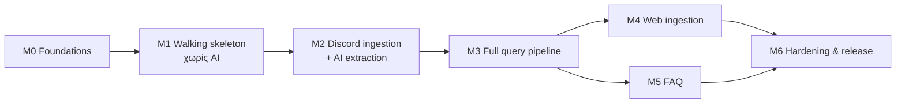

# Implementation backlog

> Βάση: [DESIGN.md](DESIGN.md). Αποφάσεις: [DECISIONS.md](DECISIONS.md).
> Μέγεθος: **S** ≤ 1 ημέρα · **M** 2–3 ημέρες · **L** 4–5 ημέρες (ενδεικτικά, 1 developer).
> Κάθε task ολοκληρώνεται με: tests πράσινα, ruff/mypy καθαρά, audit όπου αλλάζει γνώση/config.

## Milestones

| Milestone | Αποτέλεσμα που αποδεικνύει |
|-----------|----------------------------|
| **M0** | Infra, DB, queue, audit, logging δουλεύουν· CI πράσινο |
| **M1** | Admin προσθέτει γνώση με `/kb add`, χρήστης ρωτά `/ask` → απάντηση από FTS με provenance & badges. **Μηδέν AI** — αποδεικνύει ότι ο core στέκεται χωρίς LLM |
| **M2** | Γνώση συλλέγεται από Discord (explicit + passive), εξάγεται, γίνεται dedupe, βαθμολογείται, συγχρονίζεται σε edits/deletes |
| **M3** | Πλήρες routing cascade, vector, LLM synthesis με grounding, cache, degraded modes |
| **M4** | Curated web sources με validation signals & conflicts |
| **M5** | FAQ candidates → review → forum publication → updates/deprecation |
| **M6** | Eval, security suite, deploy, backups, SLOs |

M4 και M5 μπορούν να τρέξουν παράλληλα μετά το M3.

**Critical paths** (σχεδόν ισομήκη):
- Ingestion: F-01 → F-03 → F-05 → C-02 → K-01 → I-01 → I-02 → I-03 → A-04 → A-05 → W-04 → H-04
- Query/FAQ: F-01 → F-03 → F-05 → C-02 → K-01 → A-03 → Q-07 → Q-08 → Q-09 → FQ-02 → FQ-03 → FQ-04 → FQ-05 → H-04

---

## M0 — Foundations

| ID | Task | Deps | Size | Done when |
|----|------|------|------|-----------|
| F-01 | Repo scaffold: `uv`, Python 3.12, ruff, mypy, pytest, pre-commit, Dockerfile (non-root), `docker-compose` (Postgres+pgvector), Makefile, CI workflow | D-18 | S | `make check` πράσινο στο CI· `compose up` σηκώνει Postgres |
| F-02 | Settings (pydantic-settings, `guru.yaml` + env), structlog JSON, correlation id (contextvars) | F-01 | S | Logs JSON με correlation id· secrets μόνο από env |
| F-03 | DB layer: SQLAlchemy Core async + asyncpg, Alembic, migration 0001 (extensions, actors, guilds, profiles, config versions, audit_log, DB roles) | F-01 | M | `alembic upgrade/downgrade` στο CI |
| F-04 | Test infra: testcontainers Postgres+pgvector, transactional fixtures, factories, FakeClock | F-03 | S | Integration tests τρέχουν σε πραγματικό Postgres |
| F-05 | Audit service: append-only, hash-chain trigger + advisory lock, actor resolution, `verify_chain()` | F-03, F-04 | S | Tamper test: αλλοίωση row → `verify_chain` αποτυγχάνει· app role δεν κάνει UPDATE/DELETE |
| F-06 | Job queue: `jobs`/`schedules`, enqueue-in-txn, `SKIP LOCKED` dequeue, leases, backoff+jitter, dead-letter, idempotency, `LISTEN/NOTIFY` wake, concurrency classes, scheduler | F-03, F-04 | M | Concurrency test (N workers, κανένα διπλό processing)· crashed lease reclaim test |
| F-07 | Runner με roles (`bot,worker,api`), graceful shutdown, FastAPI `/healthz` `/readyz` `/metrics` (localhost) | F-02, F-06 | S | `guru run --roles worker,api` υγιές· SIGTERM αδειάζει in-flight |

## M1 — Walking skeleton (χωρίς AI)

| ID | Task | Deps | Size | Done when |
|----|------|------|------|-----------|
| C-01 | Profile config Pydantic schema v1 + semantic validators (RE2 compile, unique keys, refs, thresholds, sandboxed templates) | F-02 | M | Example YAML περνά· σπασμένα fixtures αποτυγχάνουν με σαφή μηνύματα |
| C-02 | Config service: import → validate → diff → apply (version + materialize + audit + NOTIFY) → hot reload· export· rollback. Migration 0002 (categories, entity_types, intents, aliases, dimension_values, channel_bindings, sources, grants, trust) | C-01, F-05 | L | Apply/rollback idempotent· diff σωστό· hot reload σε <2 s |
| C-03 | Reference data: import entities/aliases (CSV/YAML), admin edits, audited | C-02 | M | Import 10k entities < 30 s· duplicates αναφέρονται |
| C-04 | Permission & trust resolver (roles+user grants, bootstrap, no-escalation, webhook trust) | C-02 | S | Property tests: κανείς δεν δίνει capability που δεν έχει |
| C-05 | Text toolkit: normalization (casefold, τόνοι/accents, τελικό σ, Greeklish map), script/lang detect, tokenization, numbers/units, alias automaton (pyahocorasick) με rebuild σε config/ref change· FTS configs | C-02 | M | Golden tests el/en/Greeklish· automaton 10k aliases < 1 ms/query |
| C-06 | AION 2 profile v0 (categories, dimensions, intents, trust, prompts, entity types) | C-01, D-03, D-04, D-11, D-20 | M | Εγκεκριμένο από χρήστη· apply χωρίς errors |
| DS-01 | Discord adapter: intents, connect, guild-scoped command sync, `allowed_mentions=none`, defer helper, error handler, channel permission checks | F-07, C-04 | M | Bot online στο staging guild· commands εμφανίζονται |
| DS-02 | `/settings` panel (D-20): role/channel selectors για trusted, ποιους ακούει, σε ποιους απαντά, capabilities, watched/ask/FAQ channels· κάθε αλλαγή = νέο config version. Επιπλέον `/admin config export|import|diff|apply|rollback`, `/admin jobs`, `/admin audit` | DS-01, C-02 | L | Τίποτα hardcoded· όλα permission-checked & audited· bootstrap μόνο server Administrator |
| DS-03 | Renderer: embeds, badges, sources, applicability, components (Πηγές/👍/👎/Αναφορά), el/en localization, όρια Discord (2000/4096/6000) | DS-01 | M | Snapshot tests· truncation χωρίς σπάσιμο markdown |
| K-01 | Migration 0003: observations, revisions, chunks, claims, claim_revisions, evidence, relations, conflicts, review_tasks + repositories | C-02 | L | Repository integration tests· constraints επιβάλλονται |
| K-02 | Scoring & verification state machine (pure) + `recompute(claim)` single writer + events → jobs (outbox) + `knowledge_epoch` | K-01, C-04 | M | Hypothesis invariants (π.χ. verified ⇒ basis, no evidence ⇒ retracted εκτός human) |
| K-03 | Manual knowledge: `/kb add` (modal: statement ή structured), `/kb show <id>` (provenance), `/kb verify|correct|rephrase|deprecate|retract|merge` | K-02, DS-02, DS-03 | M | Κάθε ενέργεια → σωστό state/history + audit |
| Q-01 | Query parser (slash + mention tokens), profile resolution, scope presets, DM refusal | DS-01, C-02 | S | Table-driven tests parser |
| Q-02 | FTS retriever + **πλήρες filter set** (profile, lifecycle, min_state, origins, visibility, applicability, category) | K-01, C-05 | M | SQL tests για κάθε filter· EXPLAIN χρησιμοποιεί indexes |
| Q-10 | Visibility: allowed restricted channels ανά asker (`permissions_for`), visibility class για cache | Q-02, DS-01 | S | Leakage tests πράσινα |
| Q-03 | Extractive composer + `/ask` + mention handler → **M1 demo** | Q-01, Q-02, Q-10, DS-03 | M | E2E στο staging: add → ask → απάντηση με provenance |

## M2 — Discord ingestion + AI extraction

| ID | Task | Deps | Size | Done when |
|----|------|------|------|-----------|
| I-01 | Prefilter (signals/weights από config, exclusions, new-account cap, webhook allowlist) + RAM ring buffer + decision metrics | C-05, K-01 | M | Table-driven tests· < 1 ms/msg |
| I-02 | Capture: passive candidates + context messages, explicit (context menu, reaction, `/kb add` link) | I-01, DS-01 | M | Μη-candidates δεν αποθηκεύονται (test) |
| I-03 | Windowing (thread/reply/idle) → idempotent extraction jobs | I-02, F-06 | S | Ίδιο window δεν ξαναμπαίνει· explicit = high priority |
| A-01 | LLM port + OpenAI-compatible adapter (JSON schema output, timeouts, retries, token accounting, priority gate, circuit breaker) + FakeLLM | F-02, D-01, D-02 | M | Contract tests fake vs real (manual run)· breaker test |
| A-02 | Prompt registry: core prompts + profile slots, sandboxed Jinja2, version hashes | A-01, C-01 | S | Κάθε output φέρει `model@prompt_ver` |
| A-03 | Embedding port + ONNX local adapter, `embedding_models/embeddings` migration, batch job, content-hash cache, partial index helper | F-06, K-01, D-19 | M | Re-embed μόνο σε αλλαγή· model swap test (backfill → switch) |
| A-04 | Extraction task: prompt, schema, validators V1–V7, entity linking, applicability inference (regex + date→version) | A-01, A-02, I-03, C-03 | L | Gold set: precision ≥ στόχου· V3 απορρίπτει fabricated quotes (tests) |
| A-05 | Matching/dedupe: structured slot, statement cosine + T-EQUIV gray zone, relations, conflict detection + R1–R4 | A-03, A-04, K-02 | L | Scenario tests: duplicate, refine, contradict, version split, official-supersedes |
| A-06 | Embedding prototypes (profile/categories/intents) rebuild σε config apply | A-03, C-02 | S | Αλλαγή config → νέα prototypes χωρίς restart |
| I-04 | Edit/delete/bulk/thread sync, purge policy, evidence deactivation, recompute | I-02, K-02 | M | Delete → content purged, claims recomputed (tests) |
| I-05 | Startup backfill (cursors) + periodic evidence recheck | I-04 | M | Simulated downtime test |
| I-06 | Retention jobs + `/kb forget-me` | I-04 | S | Expired rows καθαρίζονται· forget-me end-to-end test |

## M3 — Full query pipeline

| ID | Task | Deps | Size | Done when |
|----|------|------|------|-----------|
| Q-04 | Relevance gate (aliases/keywords + lazy prototypes, thresholds) + canned rejection | A-06, Q-01 | S | Off-topic set: 0 LLM calls, 0 embeddings όταν υπάρχει hit |
| Q-05 | Intent/category cascade (explicit → rules → entity type → channel → prototypes → multi-category → T-CLASSIFY) | Q-04, A-01 | M | Routing accuracy στο golden set ≥ στόχου |
| Q-06 | Structured retriever + localized templates (single, multi-value → disputed rendering) | K-01, Q-05 | M | Structured ερωτήσεις απαντώνται χωρίς LLM |
| Q-07 | Vector retriever (filtered, iterative scan όταν index) + RRF + deterministic ranking + soft widening | A-03, Q-02 | M | Ranking unit tests· recall βελτίωση στο eval |
| Q-08 | LLM synthesis + grounding checker (citations, αριθμοί, links/mentions) + extractive fallback | Q-07, A-02 | M | Grounding fail → fallback (tests)· 0 ungrounded numbers στο eval |
| Q-09 | Answer cache (epoch + visibility class), `query_log`, rate limits, stage budgets, degraded modes | Q-08 | M | LLM down/embeddings down scenario tests |
| Q-11 | Follow-ups μέσω reply σε απάντηση του bot | Q-09 | S | Plan inheritance test |
| Q-12 | Feedback buttons → `query_log` + review task σε «Αναφορά λάθους» | Q-09, DS-03 | S | Review task δημιουργείται, χωρίς διπλότυπα |
| K-04 | Conflict & review commands: `/kb conflicts`, `/kb resolve`, `/kb acknowledge`, review queue | A-05, DS-03 | M | Επίλυση → states + audit σωστά |

## M4 — Web ingestion

| ID | Task | Deps | Size | Done when |
|----|------|------|------|-----------|
| W-01 | Safe fetcher: SSRF guard (DNS + redirects), robots.txt cache, per-domain rate limit, conditional GET, size/time caps, circuit breaker, UA | F-06 | M | SSRF suite πράσινο (private IPs, redirects, DNS rebinding) |
| W-02 | Source adapters (page list, RSS/Atom, sitemap) + scheduler + `/kb ingest-url` + domain_trust για dynamic sources | W-01, C-02 | M | Recorded fixtures· conditional GET 304 → καμία επεξεργασία |
| W-03 | Content pipeline: trafilatura, metadata/dates (+confidence), lang, simhash near-dup → independence, heading-aware chunking, chunk FTS + embeddings, change detection | W-02, A-03 | L | Date extraction corpus· near-dup test· μόνο αλλαγμένα chunks |
| W-04 | Web claim extraction + version inference + matching + scoring (reuse A-04/A-05) + liveness (404/410 → deactivate) | W-03, A-05 | M | Scenario: official update supersedes· community vs official conflict μένει open |
| W-05 | Version change handling: νέο dimension value → `needs_review` + priority re-crawl | C-02, K-02 | S | Νέο patch → σωστά flags & badges |
| W-07 | Source discovery: `SearchProvider` port + SearxNG adapter (self-hosted container), budgeted queries από entities/categories/knowledge gaps, νέες πηγές ως tier 1 | W-02 | M | Query budget τηρείται· discovered sources περνούν από W-01..W-04 |
| W-08 | Source reputation: συμφωνία/διαφωνία κάθε πηγής με verified γνώση (team/official) → Beta score → αυτόματο tier 1↔3 με όρια· tier 4 και pin μόνο χειροκίνητα· audit σε κάθε αλλαγή | W-04, K-02 | M | Scenario: πηγή με συνεχή λάθη πέφτει tier, αξιόπιστη ανεβαίνει· pinned δεν αλλάζει |

## M5 — FAQ

| ID | Task | Deps | Size | Done when |
|----|------|------|------|-----------|
| FQ-01 | FAQ migration + repos + `faq_claims` | K-01 | S | Constraints & tests |
| FQ-06 | FAQ retriever + `/faq` + scope `faq` (verbatim) | FQ-01, Q-01 | S | 0 LLM calls σε FAQ hits |
| FQ-02 | Candidates (verified+eligible, popularity, admin) + drafting (template / T-FAQ-DRAFT + grounding) | FQ-01, A-02, Q-09 | M | Popularity trigger test· grounding fail → manual |
| FQ-03 | Review workflow (embed, Approve/Edit modal/Reject, 4-eyes option) + audit | FQ-02, DS-03, C-04 | M | Permission tests· κάθε απόφαση audited |
| FQ-04 | Publication reconciler (forum posts, tags, edit-in-place, deprecate/supersede banners, lock, drift repair, backoff) | FQ-03 | M | Fake Discord: διαγραμμένο post → αποκατάσταση· idempotent re-runs |
| FQ-05 | Change propagation claim → FAQ (`needs_review`, banners, auto-draft σε supersede) | FQ-04, K-02 | S | Πίνακας §9.4 καλύπτεται από tests |

## M6 — Hardening & release

| ID | Task | Deps | Size | Done when |
|----|------|------|------|-----------|
| H-01 | Eval harness `guru eval`: golden questions, extraction gold, routing/grounding/citation metrics, % no-LLM, latency· report ανά model/prompt | Q-08, A-04 | M | Report σε markdown· baseline καταγεγραμμένο |
| H-02 | Security suite: injection corpus, leakage, SSRF, mention/link sanitization, RE2, Jinja sandbox | Q-10, W-01, Q-08 | M | Όλα πράσινα στο CI |
| H-03 | Metrics completeness (+ προαιρετικό Grafana dashboard JSON) | Q-09 | S | Όλα τα metrics του §15.2 εκτίθενται |
| H-04 | Deploy: compose prod profile, healthchecks, read-only FS, backups (pg_dump + **restore test**), runbook (token rotation, rollback, re-embed) | όλα τα MVP | M | Restore test πετυχαίνει· runbook reviewed |
| H-05 | Performance στο target hardware· βαθμονόμηση thresholds (relevance, dedupe, sufficiency)· SLOs | H-01, D-01 | S | Τιμές στο profile config με τεκμηρίωση από eval |
| H-06 | Staging E2E smoke checklist | H-04 | S | Checklist περνά πριν από production |

---

## Σειρά υλοποίησης (vertical slices)

1. **Slice A — M0 + M1:** όλο το σύστημα «χωρίς μυαλό». Αν αυτό δεν στέκει, κανένα LLM δεν θα το σώσει.
2. **Slice B — ingestion χωρίς LLM:** I-01..I-03 με FakeLLM → έλεγχος ροής δεδομένων και privacy.
3. **Slice C — AI extraction:** A-01..A-06, I-04..I-06.
4. **Slice D — πλήρες query:** Q-04..Q-12, K-04.
5. **Slice E/F — web & FAQ** παράλληλα.
6. **Slice G — hardening.**

Πρώτο βήμα μετά την έγκριση: **F-01** (απαιτεί D-18) — δεν ξεκινά πριν κλειδώσουν τα blocking D-xx του M0/M1.
