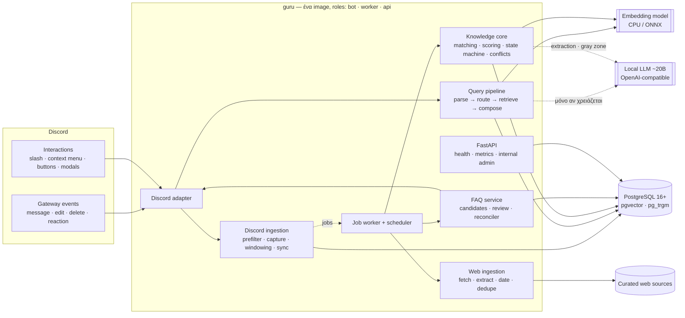
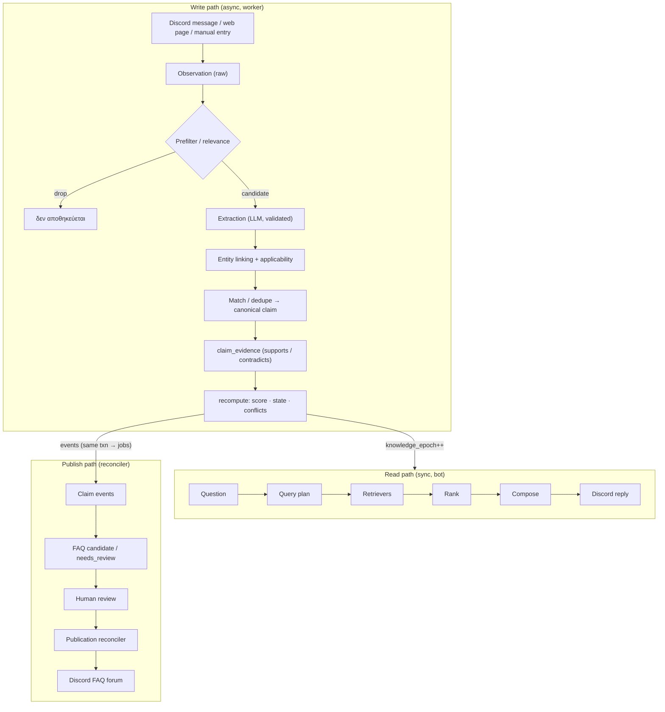
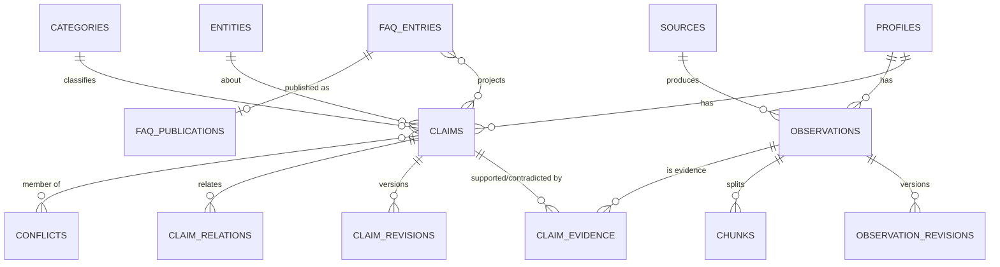
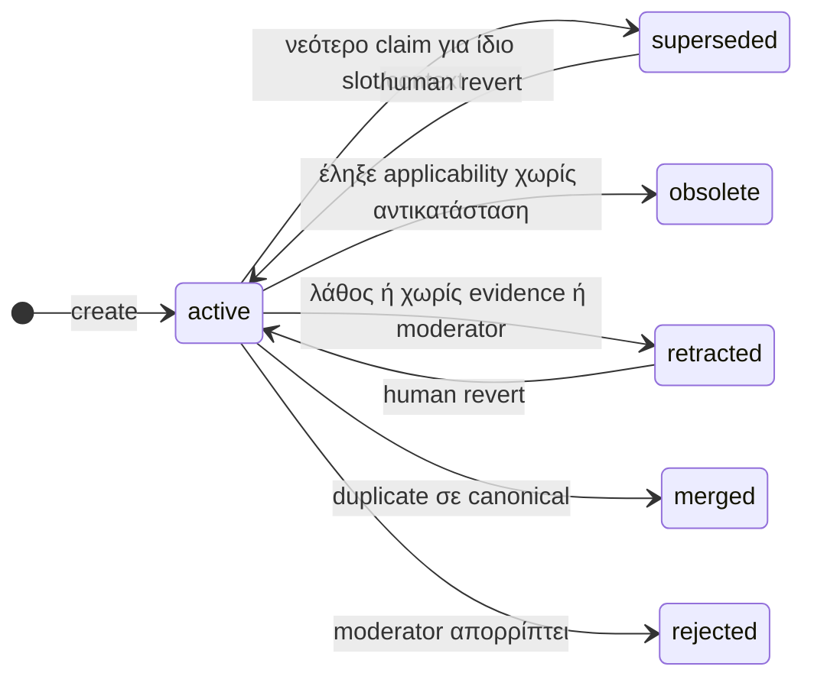
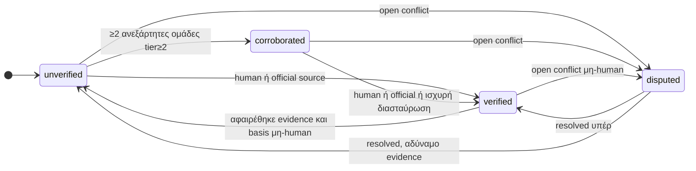
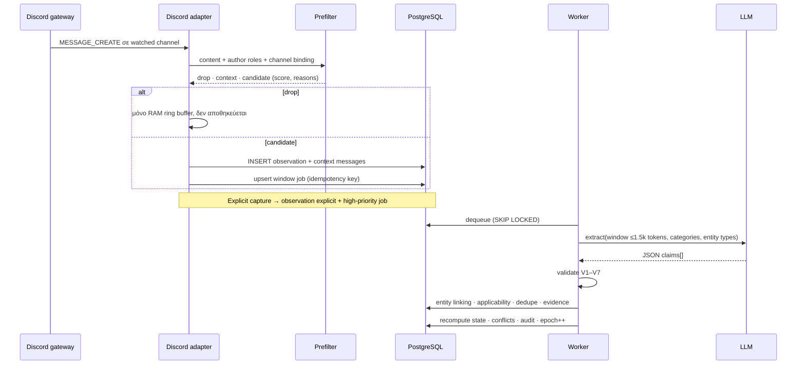
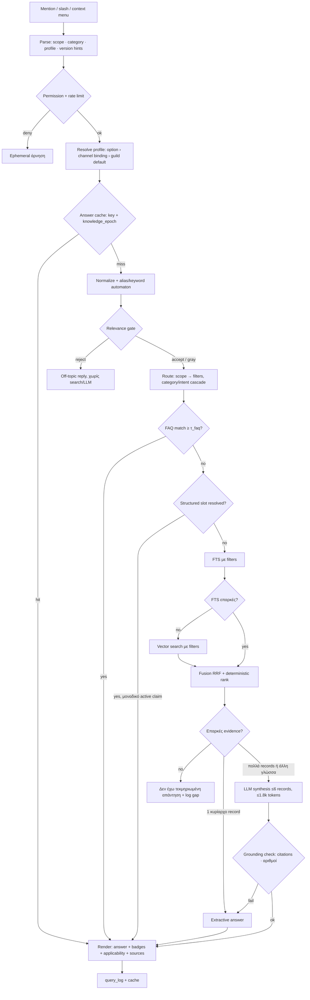
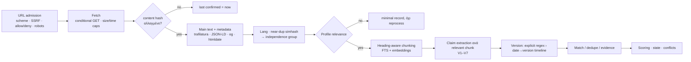
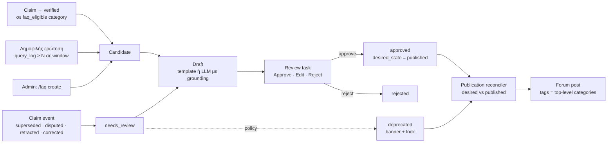

# Guru — Discord AI Knowledge System · Design v0.1 (DRAFT)

> **Κατάσταση:** προς έγκριση. Καμία υλοποίηση πριν κλειδώσουν οι αποφάσεις του [DECISIONS.md](DECISIONS.md).
> **Συνοδευτικά:** [schema.sql](schema.sql) (DDL draft) · [profile.aion2.example.yaml](profile.aion2.example.yaml) · [BACKLOG.md](BACKLOG.md)
> **Ονοματολογία:** `guru` = generic core. Το AION 2 είναι *profile* (config + reference data), όχι κώδικας.

## Περιεχόμενα

0. [Αρχές & αποκλίσεις από το spec](#0-αρχές--αποκλίσεις-από-το-spec)
1. [System architecture](#1-system-architecture)
2. [Modules & responsibilities](#2-modules--responsibilities)
3. [Data flow](#3-data-flow)
4. [Database schema](#4-database-schema)
5. [Knowledge lifecycle, scoring, conflicts](#5-knowledge-lifecycle-scoring-conflicts)
6. [Discord ingestion flow](#6-discord-ingestion-flow)
7. [Query routing flow](#7-query-routing-flow)
8. [Internet ingestion & validation](#8-internet-ingestion--validation)
9. [FAQ publishing/update flow](#9-faq-publishingupdate-flow)
10. [Permissions model](#10-permissions-model)
11. [Configuration / profile model](#11-configuration--profile-model)
12. [LLM usage strategy](#12-llm-usage-strategy)
13. [Token & compute optimisation](#13-token--compute-optimisation)
14. [Error handling](#14-error-handling)
15. [Logging & audit](#15-logging--audit)
16. [Security](#16-security)
17. [Testing strategy](#17-testing-strategy)
18. [MVP scope](#18-mvp-scope)
19. [Phase 2](#19-phase-2)

---

## 0. Αρχές & αποκλίσεις από το spec

### 0.1 Αρχές

| # | Αρχή | Πρακτική συνέπεια |
|---|------|-------------------|
| P1 | **DB = μνήμη, LLM = interpreter.** | Τίποτα δεν «είναι γνωστό» αν δεν είναι row με provenance. Το LLM ποτέ δεν απαντά από parametric knowledge. |
| P2 | **Cost ladder:** code → SQL → cache → FTS → metadata filter → embeddings → embedding-classifier → LLM. | Κάθε στάδιο μπορεί να κάνει short-circuit. Το LLM είναι το τελευταίο, όχι το default. |
| P3 | **Evidence, όχι confidence.** | Η «αλήθεια» είναι deterministic συνάρτηση των evidence (provenance, trust, independence, freshness, version). Κανένα self-reported score μοντέλου. |
| P4 | **Τα facts έχουν context.** | Κάθε claim έχει `applicability` (version, region, …). Conflict υπάρχει μόνο όταν τα contexts επικαλύπτονται. |
| P5 | **Αυστηρά layers.** | raw observation ≠ claim ≠ verified ≠ published FAQ. Διαφορετικοί πίνακες/states, διαφορετική παρουσίαση. |
| P6 | **Desired-state reconciliation** για side effects. | Τα FAQ posts στο Discord συγχρονίζονται από reconciler (desired vs published), όχι fire-and-forget. |
| P7 | **Profile-driven.** | Μηδέν AION-specific λογική στον core. Νέο profile = YAML + reference data. |
| P8 | **Fail soft.** | LLM/embeddings down → deterministic απαντήσεις (FAQ/structured/extractive). |
| P9 | **Όλο το input είναι untrusted.** | Discord και web content είναι *data*, ποτέ *instructions*. Το LLM μόνο *προτείνει*· deterministic code *αποφασίζει*. |

### 0.2 Πού αποκλίνω από το spec (και γιατί)

| # | Spec | Πρόβλημα | Πρόταση |
|---|------|----------|---------|
| X1 | Αυτόματη δημοσίευση FAQ από Internet | Δημοσίευση λάθους με το «κύρος» του bot· δύσκολο undo στο Discord. | **Default: approval gate.** Auto-publish ως opt-in policy ανά category με αυστηρά thresholds (π.χ. official source ή ≥2 ανεξάρτητες tier≥3). |
| X2 | Scope «Internet knowledge» στο query | Live search μέσα σε Discord interaction: αργό, χωρίς πλήρες validation, νέο SSRF/injection surface ανά ερώτηση. | `web` scope = **ήδη ingested & validated** web knowledge. Live search = ρητό, rate-limited, async, αποτελέσματα ως `unverified` (Phase 2). |
| X3 | Small classifier + μεγάλο LLM | Δύο generative μοντέλα = διπλό VRAM. | «Small classifier» = **embedding-prototype classifier** (zero training, ms σε CPU). Phase 2: logistic regression πάνω σε embeddings από τα logs. Ένα generative μοντέλο (~20B). |
| X4 | Category routing περιορίζει την αναζήτηση | Hard filter → misclassification = «δεν ξέρω». | **Soft filter:** ρητό category = hard· inferred category = boost + bounded widening. |
| X5 | Confidence score | Ένας αριθμός κρύβει το «γιατί». | **Verification state machine + evidence summary** (εξηγήσιμο). Αριθμητικό `support_score` μόνο για ranking. |
| X6 | Συλλογή από όλα τα μηνύματα | Χαμηλό precision, κόστος, privacy. | **Hybrid:** explicit capture από trusted (context menu / reaction) = κύριο σήμα· passive μόνο μετά από deterministic prefilter, πάντα `unverified`. |
| X7 | Swappable database | Πλήρης φορητότητα = lowest common denominator (χάνεις pgvector, tsvector, SKIP LOCKED, jsonb). | Repository **ports** στο domain boundary, Postgres η μόνη υλοποίηση. Vector search πίσω από `VectorIndex` port (Qdrant μόνο αν το απαιτήσει scale). |
| X8 | FastAPI | Δεν χρειάζεται για τον core· admin web UI = Discord OAuth2 = attack surface. | Thin FastAPI: health, metrics, internal admin (localhost). Admin μέσω Discord commands + CLI στο MVP. Web UI Phase 2. |
| X9 | «Version relevance» | Παιχνίδι-specific έννοια. | Γενίκευση: **applicability dimensions** ανά profile (version, region, server, season, …). |
| X10 | Embeddings | Embedding ανά μήνυμα = άπειρα duplicates. | Embed **μόνο canonical claims & web chunks**. Raw Discord μηνύματα δεν γίνονται ποτέ embed. |
| X11 | Relationships | LLM-generated graph = μη ελέγξιμο. | Typed relations μόνο από rules ή άνθρωπο. Το LLM *προτείνει* `duplicate/contradicts/refines` μόνο στο gray zone. |
| X12 | Redis «αν χρειαστεί» | Συμφωνώ. | Όχι στο MVP: queue = Postgres `SKIP LOCKED`, wakeups = `LISTEN/NOTIFY`, cache = Postgres + in-process LRU. Κριτήρια εισαγωγής Redis στο §13. |

---

## 1. System architecture

### 1.1 Overview



### 1.2 Layering (hexagonal)

| Layer | Περιεχόμενο | Κανόνας |
|-------|-------------|---------|
| `core/` | Domain models (dataclasses), state machines, scoring, routing rules, validators | **Χωρίς I/O**. 100% unit-testable. |
| `ports/` | `typing.Protocol`: `KnowledgeRepo`, `ObservationRepo`, `FaqRepo`, `JobQueue`, `LLMProvider`, `EmbeddingProvider`, `VectorIndex`, `SearchProvider`, `Fetcher`, `ContentExtractor`, `ChatPlatform`, `Clock` | Ο core εξαρτάται μόνο από ports. |
| `adapters/` | Postgres (SQLAlchemy Core + asyncpg), discord.py, OpenAI-compatible HTTP, ONNX embeddings, trafilatura, SearxNG (P2) | Αντικαθίστανται χωρίς αλλαγή στον core. |
| `services/` | Use cases: `IngestService`, `QueryService`, `KnowledgeService`, `FaqService`, `ConfigService`, `AdminService` | Orchestration, transactions. |
| `entrypoints/` | `bot`, `worker`, `api`, `cli` | Wiring/DI (απλό factory, όχι framework). |

### 1.3 Process model

- Ένα codebase, ένα image: `guru run --roles bot,worker,api`.
- **MVP:** ένα container, όλα τα roles σε ένα asyncio loop· CPU-bound (embeddings, HTML parsing) σε thread pool. Ελάχιστοι πόροι.
- **Scale-out:** ίδιο image, ξεχωριστά containers ανά role. Ο bot παραμένει 1 instance (ένα gateway connection αρκεί για < 2.500 guilds).
- **LLM concurrency:** interactive queries έχουν προτεραιότητα· background LLM jobs concurrency = 1 και κάνουν yield όταν υπάρχει interactive in-flight.

### 1.4 Deployment (MVP)

`docker compose`: `postgres` (pgvector image), `guru`, `llm` (Ollama/llama.cpp/vLLM — ή υπάρχον endpoint). **Χωρίς Redis.** Postgres και LLM δεν εκτίθενται δημόσια· API μόνο localhost.

Υπόθεση hardware (επιβεβαίωση: D-01): 1 host, GPU ≥16 GB VRAM για ~20B σε 4-bit, 4+ cores, 16 GB RAM, SSD.

### 1.5 Stack

| Περιοχή | Επιλογή | Σημείωση |
|---------|---------|----------|
| Runtime | Python 3.12, `uv` (lock με hashes) | |
| Discord | discord.py 2.x | app commands, context menus, raw events |
| DB | PostgreSQL 16+, pgvector ≥ 0.8, pg_trgm | 0.8: iterative index scans για filtered ANN |
| DB access | SQLAlchemy 2 **Core** + asyncpg, Alembic | Ρητό SQL στο retrieval, όχι ORM magic |
| Validation/config | Pydantic v2, pydantic-settings, PyYAML (safe_load) | |
| API | FastAPI + uvicorn (thin) | |
| HTTP | httpx | + δικό μας SSRF guard |
| Web extraction | trafilatura, htmldate, feedparser | |
| Text | pyahocorasick (alias automaton), rapidfuzz (quote verification), google-re2 (admin regex, ReDoS-safe) | |
| Embeddings | ONNX Runtime (fastembed ή sentence-transformers ONNX export) | model: D-19 |
| Observability | structlog (JSON), prometheus-client | |
| Tests | pytest, pytest-asyncio, testcontainers (Postgres+pgvector), hypothesis, respx | |
| Quality | ruff, mypy (strict στον core) | |

---

## 2. Modules & responsibilities

| Module | Ευθύνη | Deterministic; | Χρήση AI |
|--------|--------|----------------|----------|
| `config` | Pydantic schemas, YAML import/export, semantic validation, diff, versioning, materialization, hot reload | ✅ | — |
| `permissions` | Capability & trust resolution, no-escalation rules | ✅ | — |
| `text` | Normalization (casefold, accents/τόνοι, τελικό σ), script/lang detect, tokenization, numbers/units, alias automaton | ✅ | — |
| `discord_adapter` | Gateway, commands, components, rendering, visibility checks, interaction defer | ✅ | — |
| `ingest.discord` | Prefilter, ring buffer, capture, windowing, edit/delete sync, backfill | ✅ | μέσω `extraction` |
| `ingest.web` | Safe fetcher, robots, source adapters, main-text extraction, dating, near-dup, chunking | ✅ | μέσω `extraction` |
| `extraction` | LLM claim extraction + αυστηροί validators (schema, ids, verbatim quotes) | validators ✅ | **LLM** |
| `knowledge` | Claims/evidence repo, entity linking, applicability, dedupe, scoring, state machine, conflicts, history | ✅ | LLM μόνο gray-zone equivalence |
| `retrieval` | FAQ, structured SQL, FTS, vector retrievers· filters· fusion· ranking | ✅ | embeddings |
| `routing` | Parse, profile resolve, relevance gate, scope, intent/category router | ✅ | embeddings· LLM fallback σπάνια |
| `answer` | Template/extractive answers, LLM synthesis, grounding checks, uncertainty rendering | ✅ εκτός synthesis | **LLM** (συνθήκες) |
| `faq` | Candidates, drafts, review workflow, publication reconciler, change propagation | ✅ | LLM draft (με human approval) |
| `jobs` | Postgres queue, worker, scheduler, retries, leases, dead-letter | ✅ | — |
| `providers.*` | Ports + adapters: llm, embeddings, search, fetch | — | — |
| `audit` | Append-only log, hash chain | ✅ | — |
| `observability` | Logs, metrics, query traces | ✅ | — |
| `api` | Health, readiness, metrics, internal admin | ✅ | — |

---

## 3. Data flow

Τρία μονοπάτια + domain events.



**Consistency rule (transactional outbox):** κάθε state change που απαιτεί side effect γράφει job στον `jobs` πίνακα **στην ίδια transaction**. Κανένα Discord post/edit εκτός jobs. Domain events: `ClaimCreated`, `ClaimStateChanged`, `ClaimSuperseded`, `ClaimRetracted`, `ConflictOpened`, `ObservationDeleted`, `ConfigApplied`, `DimensionValueAdded`.

---

## 4. Database schema

Πλήρες DDL draft: **[schema.sql](schema.sql)**. Εδώ η λογική.

### 4.1 Ομάδες πινάκων

| Ομάδα | Πίνακες | Ρόλος |
|-------|---------|-------|
| Tenancy/config | `guilds`, `profiles`, `profile_config_versions` | Config snapshot (jsonb) ανά version = ιστορικό & rollback. |
| Materialized config | `categories`, `entity_types`, `intents`, `aliases`(origin=config), `dimension_values`, `channel_bindings`, `sources`, `permission_grants`, `trust_assignments` | Ξαναχτίζονται transactionally σε κάθε config apply. FKs & γρήγορα queries. |
| Reference data | `entities`, `aliases`(origin≠config) | Χιλιάδες rows (items, bosses…) — **όχι** μέσα στο config YAML. Import CSV/YAML + admin edits, audited. |
| Actors | `actors` | Ενιαίο actor model (Discord user, system component, CLI) για audit & provenance. |
| Raw (L0) | `observations`, `observation_revisions`, `chunks` | Ό,τι συλλέχθηκε, με πλήρες provenance. Chunks = unstructured retrieval unit για web docs. |
| Knowledge | `claims`, `claim_revisions`, `claim_evidence`, `claim_relations`, `conflicts`, `conflict_members` | Canonical γνώση + evidence + ιστορικό + conflicts. |
| Retrieval | `embedding_models`, `embeddings`, `answer_cache` | |
| FAQ | `faq_entries`, `faq_revisions`, `faq_claims`, `faq_publications` | FAQ = projection των claims· publication state ξεχωριστά. |
| Workflow | `review_tasks`, `jobs`, `schedules`, `channel_cursors` | Human-in-the-loop queue, job queue, cron, Discord backfill cursors. |
| Observability | `query_log`, `audit_log` | |

### 4.2 Βασικές επιλογές

- **`text` + `CHECK`** αντί για PG `ENUM` (ευκολότερα migrations).
- `bigint` identity PKs· Discord snowflakes ως `bigint`. User-facing ids: `K-1042` (claim), `F-17` (FAQ).
- **Single writer για derived πεδία:** `verification`, `evidence_summary`, `support_score`, `origins`, `is_public`, `audience_channel_ids` γράφονται **μόνο** από `knowledge.recompute(claim_id)` (pure function + 1 UPDATE). Ποτέ χειροκίνητα.
- **Append-only** revisions (`claim_revisions`, `observation_revisions`, `faq_revisions`) + `audit_log` χωριστά.
- **Structured dedupe** με unique partial index `(profile, slot_key, applicability_hash, value_hash) WHERE active`.
- **Embeddings polymorphic** με `model_id` + partial HNSW index ανά (model, owner_type) μέσω expression `embedding::vector(N)`. Αλλαγή μοντέλου = νέο `embedding_models` row → backfill → switch → retire. Κανένα schema change.
- **FTS** πάνω σε `search_text` που κανονικοποιείται **στην εφαρμογή** (ίδια συνάρτηση για docs & queries) + `ts_config` ανά row (`guru_simple`, `english`, `greek`).
- **Μεγέθη:** claims 10⁴–10⁵, chunks 10⁴–10⁵, observations ~10⁵/έτος. Μικρό για Postgres· κάτω από ~50k vectors/profile αρκεί exact scan με filters· HNSW όταν χρειαστεί.

### 4.3 Core knowledge ER (απλοποιημένο)



### 4.4 Metadata που ζητήθηκε → πού ζει

| Metadata | Πεδίο |
|----------|-------|
| profile | `claims.profile_id` |
| category | `claims.category_id` |
| source type / identifier | `observations.kind`, `observations.external_id`, `sources.kind/locator` (μέσω `claim_evidence`) |
| author | `observations.author_actor_id` (+ `author_trust_tier` snapshot) |
| Discord message/channel | `observations.guild_id/channel_id/thread_id/message_id` |
| URL | `observations.url/canonical_url` |
| creation / retrieval / last update | `claims.created_at/updated_at`, `observations.published_at/source_updated_at/retrieved_at` |
| confidence | `claims.verification` + `verification_basis` + `evidence_summary` (+ `support_score` για ranking) |
| verification state | `claims.verification` |
| version relevance | `claims.applicability` (jsonb ανά dimension) |
| status | `claims.lifecycle` |
| relationships | `claim_relations`, structured values τύπου `entity_ref` |

---

## 5. Knowledge lifecycle, scoring, conflicts

### 5.1 Layers & ορατότητα

| Layer | Αποθήκευση | Προς χρήστες | Badge |
|-------|------------|--------------|-------|
| **Raw** | `observations` / `chunks` | Μόνο ως *πηγή* ή passage με ρητή σήμανση «από πηγή, μη επεξεργασμένο». Ποτέ ως fact. | 📄 |
| **Processed** | `claims` · `verification=unverified` | Ναι, χαμηλότερο ranking | ⚠️ Μη επιβεβαιωμένο |
| **Corroborated** | `verification=corroborated` | Ναι | ☑️ Διασταυρωμένο |
| **Verified** | `verification=verified` (+ basis) | Ναι | ✅ Επιβεβαιωμένο |
| **Conflicting** | `verification=disputed` + `conflicts` | Ναι, **και οι δύο πλευρές** | ⚔️ Αντικρουόμενο |
| **Historical** | `lifecycle ∈ {superseded, obsolete}` | Μόνο σε ερώτηση για παλιότερο version ή `history` | 🕒 |
| **Removed** | `lifecycle ∈ {retracted, rejected, merged}` | Ποτέ (μόνο admin) | — |

Default ελάχιστο state απάντησης: configurable ανά profile (`search.default_min_state`) — απόφαση D-07.

### 5.2 Δύο ορθογώνιοι άξονες

**Lifecycle** (τι συμβαίνει στο record) ≠ **Verification** (πόσο τεκμηριωμένο είναι). Το verification είναι *derived* από evidence· το lifecycle αλλάζει από rules ή ανθρώπους.





### 5.3 Ιστορικό — σημασιολογία αλλαγών

| Κατάσταση | Μηχανισμός | Τι γίνεται το παλιό |
|-----------|------------|---------------------|
| Διόρθωση διατύπωσης | `claim_revisions` (`rephrase`) | Μένει στα revisions |
| **Ήταν λάθος** (ποτέ δεν ίσχυε) | Νέο claim + relation `corrects` | `retracted` (reason=`incorrect`) |
| **Άλλαξε με patch** (ίσχυε) | Νέο claim με νέο applicability + `supersedes`· κλείνει το range του παλιού | `superseded` — απαντάται για παλιό version |
| Δεν ισχύει πια, χωρίς αντικατάσταση | — | `obsolete` |
| Duplicate | Evidence μεταφέρεται στο canonical | `merged` (+ `merged_into`) |
| Διαγράφηκε η πηγή | Evidence `active=false` → recompute | Αν δεν μείνει support & όχι human → `retracted` (reason=`no_evidence`) |

Η διάκριση «ήταν λάθος» vs «ίσχυε παλιότερα» είναι κρίσιμη: αλλάζει την απάντηση για παλιά versions και το source accuracy tracking (P2).

### 5.4 Evidence scoring (deterministic, εξηγήσιμο)

```
w(e) = T[tier(e)] · F(e) · V(e) · Q(e)
  T : βάρος tier (config), π.χ. {0:0, 1:0.25, 2:0.5, 3:0.8, 4:1.0}
  F : freshness = max(f_min, 0.5 ^ (age_days / half_life(category)))      half_life=null → 1
  V : 1 αν version(e) ∈ applicability(claim), αλλιώς v_mismatch (π.χ. 0.4)
  Q : 1 αν quote_verified ή human entry, αλλιώς 0.5

G(stance)  = ομάδες ανεξαρτησίας των active evidence με αυτό το stance
S_sup = Σ_{g ∈ G(supports)}    max_{e∈g} w(e)       community ομάδες (tier≤2): άθροισμα ≤ community_cap
S_con = Σ_{g ∈ G(contradicts)} max_{e∈g} w(e)
```

- **Independence group:** Discord → `discord:user:<id>` (κάθε user μία ομάδα)· web → `sources.independence_group` (οργανισμός/domain)· near-duplicate/syndicated docs (simhash) → ομάδα του αρχικού.
- **`community_cap`:** 20 χρήστες που επαναλαμβάνουν το ίδιο δεν ξεπερνούν μία official πηγή (anti-Sybil).
- `support_score = S_sup − λ·S_con` χρησιμοποιείται **μόνο για ranking**.

**Verification rules** (πρώτο που ταιριάζει· thresholds ανά profile/category):

```
1. human_verified                                                    → verified   (basis=human)
2. open conflict που περιλαμβάνει το claim                           → disputed
3. ∃ supporting tier=4 ∧ ∄ νεότερο contradicting tier=4
   ∧ policy.auto_verify_official                                     → verified   (basis=official_source)
4. |G(supports, tier≥t_v)| ≥ n_v ∧ S_con = 0
   ∧ policy.auto_verify_corroboration                                → verified   (basis=corroboration)
5. |G(supports, tier≥2)| ≥ 2                                         → corroborated
6. αλλιώς                                                            → unverified
Lifecycle: κανένα active supporting evidence ∧ όχι human            → retracted (no_evidence)
Human-verified + νέο contradicting tier≥3 μετά το verified_at       → needs_review=true + review task
```

Το `evidence_summary` (jsonb) αποθηκεύει τα inputs: `{groups_sup, groups_con, max_tier, newest_evidence_at, origins, basis, version_match}` → rendering «2 official, 1 community · τελ. επιβεβαίωση 2026-09-12 · v1.3».

### 5.5 Conflicts

**Detection:**
- **Structured:** ίδιο `slot_key` (entity+attribute), διαφορετικό `value_hash`, επικαλυπτόμενο applicability → conflict. 100% deterministic.
- **Statements:** στο dedupe (§5.6), όταν το T-EQUIV επιστρέφει `contradicts` → relation `contradicts` + conflict. Επιπλέον heuristic: ίδιο entity + ίδιο pattern, διαφορετικοί αριθμοί → flag.

**Auto-resolution** (μόνο αυτά, με σειρά, κάθε απόφαση στο audit):

| Rule | Συνθήκη | Αποτέλεσμα |
|------|---------|------------|
| R1 | Applicability δεν επικαλύπτεται μετά από refinement | Δεν είναι conflict· και τα δύο ισχύουν στο context τους |
| R2 | Ίδια independence group, νεότερο evidence | Η πηγή διόρθωσε τον εαυτό της → παλιό `superseded` |
| R3 | Πλευρά Α έχει tier-4 evidence **νεότερο** από όλο το evidence της Β, και Β max tier < 4 | Β `superseded` |
| R4 | Οτιδήποτε άλλο | **Conflict παραμένει `open`** + review task. Η απάντηση δείχνει και τις δύο πλευρές |

Ρητά: αν community (νεότερη) διαφωνεί με official (παλαιότερη) → **δεν** λύνεται αυτόματα (μπορεί να είναι hotfix). Admin μπορεί να θέσει `acknowledged` (γνωστή αμφισημία, εμφάνιση και των δύο).

### 5.6 Dedupe / canonicalization

| Τύπος | Μέθοδος | Κόστος |
|-------|---------|--------|
| Structured | Exact match `(slot_key, applicability_hash, value_hash)` | SQL |
| Statement | Embedding του extracted statement → top-k ίδιου profile/category | ms |
| | `cos ≥ τ_high` (π.χ. 0.92) → ίδιο claim (link evidence) | — |
| | `τ_low ≤ cos < τ_high` → **T-EQUIV** (LLM, enum: `equivalent/contradicts/refines/unrelated`) | ~300 tokens |
| | `cos < τ_low` → νέο claim | — |

Thresholds βαθμονομούνται στο eval set (H-01), όχι με το μάτι. Raw μηνύματα **δεν** γίνονται embed· γίνεται embed το *canonical statement*.

### 5.7 Αλλαγή version

Admin καταχωρεί νέο `dimension_value` (π.χ. patch 1.4, ημερομηνία, region) → job: claims σε categories με `volatile_on_version=true` και ανοιχτό applicability → `needs_review=true`· απαντήσεις δείχνουν «🕒 από v1.3 — μπορεί να άλλαξε»· web sources των categories αυτών → re-crawl με προτεραιότητα. Το date→version mapping γίνεται deterministic από το timeline.

---

## 6. Discord ingestion flow

### 6.1 Capture modes

| Mode | Trigger | Ποιος | Prefilter | Priority |
|------|---------|-------|-----------|----------|
| **explicit** | Context menu «Add to knowledge» · reaction (π.χ. 📌) · `/kb add` (modal) · `/kb ingest-url` | `kb.ingest` | Παρακάμπτεται | Υψηλή |
| **passive** | Μήνυμα σε watched channel | Authors που επιτρέπει το channel policy | Ναι | Χαμηλή |
| **context** | Reply target / προηγούμενα μηνύματα ενός candidate | — | — | Ποτέ evidence από μόνο του (αποθηκεύεται ως context, μικρό retention) |
| **backfill** | Startup / downtime | — | Ναι | Χαμηλή |

Webhook/bot μηνύματα: αγνοούνται, εκτός allowlist (π.χ. followed announcement channel από official server → tier 4). Απόφαση D-21.

### 6.2 Sequence



### 6.3 Prefilter (deterministic, < 1 ms)

| Τύπος | Σήματα (weights στο config) |
|-------|-----------------------------|
| **Exclusions** | bot/webhook (εκτός allowlist), system messages, commands, `< min_chars`, μόνο emoji/links/mentions, author tier < `min_author_tier`, νέος λογαριασμός (< N ημέρες) σε passive |
| **Θετικά** | alias hit (entity), keyword hit (category/profile), αριθμοί/μονάδες, URL από allowlisted domain, reply σε ερώτηση, author tier ≥3, high-signal channel |
| **Ειδικά** | Ερωτήσεις → `context` + σήμα ζήτησης για FAQ (όχι γνώση) |

`score ≥ threshold` → candidate. Αποφάσεις καταγράφονται (counts + reasons) για tuning και μελλοντικό learned gate (P2).

### 6.4 Windowing

Segmentation: thread → reply chain → idle gap. Window κλείνει σε `idle 5 min` ή `30 msgs` ή `1.5k tokens`. **Ένα LLM call ανά συζήτηση**, όχι ανά μήνυμα, με το context που χρειάζεται (ερώτηση Α + απάντηση Β). Idempotency key: `channel:first_id:last_id:content_hash`.

### 6.5 Extraction contract & validation

Output (JSON Schema, constrained decoding):

```json
{"claims": [{
  "kind": "fact|tip|procedure",
  "statement": "canonical language, αυτοτελές",
  "category": "<category key>",
  "entities": ["<surface form>"],
  "attribute": "<attr key | null>", "value": null,
  "version_hint": "<string | null>",
  "source_ids": ["m3"], "quotes": ["verbatim span από m3"]
}]}
```

| # | Validator | Αποτυχία → |
|---|-----------|------------|
| V1 | Schema (Pydantic) | 1 repair retry, μετά drop |
| V2 | `source_ids ⊆ window` | drop claim |
| V3 | **Κάθε quote υπάρχει verbatim** (normalized, rapidfuzz partial ratio ≥ 0.9) στο αντίστοιχο μήνυμα | drop ή `Q=0.5` (config) |
| V4 | `category ∈ profile` | default category του channel |
| V5 | attribute/value valid κατά JSON Schema του entity type | downgrade σε statement |
| V6 | Όρια μήκους· χωρίς URLs/mentions που δεν υπάρχουν στην πηγή | drop |
| V7 | `kind` επιτρεπτό (opinions/questions/jokes απορρίπτονται) | drop |

Το V3 είναι ο κύριος deterministic φραγμός σε hallucinations: κάθε claim πρέπει να «δείχνει» σε κείμενο που υπάρχει.

### 6.6 Edit/delete sync

| Event (raw, χωρίς cache dependency) | Ενέργεια |
|-------------------------------------|----------|
| `on_raw_message_edit` — ίδιο content hash | Αγνοείται (embed-only edit) |
| `on_raw_message_edit` — νέο content | Νέο `observation_revision`· evidence από παλιό rev → `active=false (source_edited)`· re-extraction του window· recompute affected claims |
| `on_raw_message_edit` — μη αποθηκευμένο μήνυμα | Ξανά prefilter (το edit μπορεί να πρόσθεσε πληροφορία) |
| `on_raw_message_delete` / `bulk_delete` | `status=deleted`, **content purge** (κρατιούνται ids/hash για audit), evidence `active=false (source_deleted)`, recompute |
| Thread/channel delete | Bulk ως άνω |
| `/kb forget-me` | Purge όλων των observations του user, recompute (claims μένουν μόνο αν στηρίζονται αλλού ή είναι human-verified) |

### 6.7 Downtime reconciliation

- **Νέα μηνύματα:** `channel_cursors.last_message_id` → `history(after=…)` bounded στο startup.
- **Edits/deletes κατά το downtime:** δεν ανιχνεύονται από events· periodic job ξαναελέγχει τα μηνύματα που είναι **evidence σε active claims** (ηλικίας ≤ N ημέρες), rate-limit aware. Ρίσκο R-07.

### 6.8 Privacy defaults

Μη-candidate μηνύματα **δεν αποθηκεύονται**. Context-only: retention 14 ημέρες. Deleted → άμεσο purge. User ids σε logs: salted hash. Απόφαση D-06.

---

## 7. Query routing flow

### 7.1 Triggers

Μόνο: **mention** του bot (συμπ. reply-σε-μήνυμα με mention → το referenced message γίνεται context), **`/ask`**, **`/faq`**, context menu **«Ask Guru about this»**. Τίποτα άλλο δεν ενεργοποιεί το pipeline.

### 7.2 Flow



### 7.3 Parsing

- **Slash:** typed options (`question`, `scope`, `category` με autocomplete, `profile`, `version`). Μηδέν parsing ambiguity — προτιμώμενο.
- **Mention:** leading tokens (configurable, με ελληνικά aliases): `faq:` `verified:` `internal:` `web:` `all:` · `#category` · `v1.3` · `region:KR`. Άγνωστα tokens μένουν στην ερώτηση. Τελικό syntax: D-17.

### 7.4 Scope model

Scope = `(origins, min_state, faq_only)`. Τα 4 ζητούμενα scopes είναι presets:

| Preset | origins | min_state | Σημείωση |
|--------|---------|-----------|----------|
| `faq` | — | published FAQ | Verbatim, συνήθως **0 LLM** |
| `verified` | όλα | `verified` | |
| `internal` | discord, manual, import | profile default | |
| `web` | web | profile default | Stored web knowledge (live: P2) |
| `all` (default) | όλα | profile default | |

Επέκταση χωρίς αλλαγή κώδικα: `source:<key>` filter.

### 7.5 Relevance gate

```
rel = max( 1.0·[entity alias hit],
           0.8·[profile/category keyword hit],
           sim(q, profile prototypes) )        ← embedding μόνο αν δεν υπάρχει hit (lazy)
rel ≥ τ_accept           → accept
τ_reject ≤ rel < τ_accept → gray: μόνο local retrieval· αν δεν βρεθεί τίποτα → «εκτός θέματος;»
rel < τ_reject           → reject (canned reply)
```

Ρητό category/scope από τον χρήστη → accept. Το gray zone **δεν** χρειάζεται LLM: αφού ποτέ δεν απαντάμε χωρίς evidence, η ίδια η (φθηνή) ανάκτηση είναι το relevance test.

### 7.6 Intent / category cascade

| Βήμα | Μηχανισμός | Κόστος |
|------|------------|--------|
| 1 | Ρητό (option/token) → **hard filter** | 0 |
| 2 | Intent rules (RE2 patterns + aliases) → `(category, attribute, answer_mode)` | μs |
| 3 | Entity type → default category | μs |
| 4 | Channel default category (ασθενές prior) | 0 |
| 5 | Embedding prototypes (descriptions + examples) — top-1 με margin | ms |
| 6 | Αν ≥2 categories εντός margin → **αναζήτηση και στις δύο** (soft) | ms |
| 7 | T-CLASSIFY (LLM, enum) — μόνο αν το 6 δίνει ουσιωδώς διαφορετικά αποτελέσματα | ~400 tokens, σπάνιο |

Inferred category = **boost + bounded widening**: αν δεν βρεθεί επαρκές evidence, ένα δεύτερο pass χωρίς category filter.

### 7.7 Retrieval ladder & filters

Κοινά filters (SQL `WHERE`) σε όλους τους retrievers:
`profile_id` · `lifecycle='active'` (ή `superseded` για ερώτηση παλιού version) · `verification ≥ min_state` · `origins && scope.origins` · **visibility** (`is_public OR audience_channel_ids && :allowed`) · applicability ∩ version context · category (hard/soft).

| # | Retriever | Short-circuit |
|---|-----------|---------------|
| 1 | FAQ (FTS + trigram στο question, + embedding αν διαθέσιμο) | score ≥ τ_faq → verbatim FAQ + link |
| 2 | Structured (`entity + attribute` → SQL) | 1 active claim → template answer· >1 τιμές → disputed rendering |
| 3 | FTS (`ts_rank_cd`) | Επαρκές → skip vector (config `search.hybrid: fallback|always`) |
| 4 | Vector (pgvector, filtered· `hnsw.iterative_scan` αν index) | — |
| 5 | Fusion & rank | — |

### 7.8 Ranking

```
score(r) = RRF(r) · S_state · S_fresh · S_version · S_cat
RRF(r)    = Σ_{list∈{fts,vec}} 1 / (k + rank_list(r))            k = 60
S_state   : verified 1.0 · corroborated 0.85 · disputed 0.75 · unverified 0.6   (config)
S_fresh   : F(last_evidence_at)
S_version : 1 εφαρμόσιμο · 0.5 άγνωστο · (εκτός → φιλτραρισμένο)
S_cat     : 1 match · 0.7 sibling · 0.5 εκτός (soft mode)
```

Cross-encoder reranker: P2, μόνο αν το eval δείξει κέρδος.

### 7.9 Answer modes

| Mode | Πότε | LLM |
|------|------|-----|
| `faq` | FAQ match | ❌ |
| `structured` | Slot resolved | ❌ (localized templates) |
| `extractive` | 1 κυρίαρχο record (top1/top2 ≥ ρ) και ίδια γλώσσα ή `allow_cross_language_extractive` | ❌ |
| `llm` | Σύνθεση πολλών records ή μετάφραση | ✅ |
| `no_answer` | Ανεπαρκές evidence | ❌ (+ gap log για FAQ/web P2) |

Profile setting `answer.llm_synthesis: auto|always|never`.

### 7.10 LLM synthesis contract

Input: core system prompt (~250 tokens, static prefix → prefix cache) + profile slots + records σε compact μορφή:

```
[R1] state=verified basis=official src=official_site date=2026-09-01 v=1.3 region=KR cat=bosses
Ο Boss X κάνει respawn κάθε 4 ώρες.
```

Output JSON: `{"answer": "...", "cited": ["R1","R3"], "uncertainty": "none|conflict|weak"}`.

Grounding checks (deterministic): `cited ⊆ given` · κάθε αριθμός στην απάντηση υπάρχει σε cited record · όρια μήκους · κανένα URL/mention. Αποτυχία → **extractive fallback**. Conflicts: ο renderer (όχι το LLM) παρουσιάζει τις πλευρές.

### 7.11 Rendering

```
✅ Επιβεβαιωμένο · ισχύει για v1.3 (KR)
<απάντηση>
Πηγές: [1] Official patch notes · 2026-09-01   [2] guides channel · 2026-09-03 (jump link)
K-1042 · K-1077                                  [Πηγές] [👍] [👎] [Αναφορά λάθους]
```

```
⚔️ Αντικρουόμενες πληροφορίες
• 5% — Official site (2026-08-20)
• 3% — 2 community πηγές (2026-09-10, νεότερες)
Δεν μπορώ να επιβεβαιώσω ποιο ισχύει.
```

`allowed_mentions=none` πάντα. URLs μόνο από `sources/observations`, ποτέ από LLM text.

### 7.12 Follow-ups

Reply σε απάντηση του bot → φορτώνεται το query plan (entities, category, version) από `query_log` μέσω bot message id. **Όχι chat history στο prompt.**

### 7.13 Latency budget (στόχοι, επιβεβαίωση στο H-05)

| Path | p50 | p95 |
|------|-----|-----|
| reject / cache / FAQ / structured | < 300 ms | < 1 s |
| FTS / vector extractive | < 600 ms | < 1.5 s |
| LLM synthesis (local 20B) | 3–8 s | < 20 s |

Slash: `defer()` αμέσως (όριο Discord 3 s), follow-up εντός 15 λεπτών. Mention: typing indicator.

---

## 8. Internet ingestion & validation

### 8.1 Πηγές & είσοδοι

| Είσοδος | MVP | Περιγραφή |
|---------|-----|-----------|
| Curated sources (page list, RSS/Atom, sitemap) | ✅ | Ανά profile, με tier, schedule, selectors |
| `/kb ingest-url` από trusted | ✅ | Explicit web capture |
| Search provider (SearxNG/Brave/…) | P2 | Πίσω από `SearchProvider` port |
| Gap-driven search (επαναλαμβανόμενα `no_answer`) | P2 | Budgeted, async |
| Live search στο query | P2 | Ρητό opt-in, αποτελέσματα `unverified` |

Άγνωστα domains → dynamic `sources` row με tier από `domain_trust` rules (default tier 1).

### 8.2 Pipeline



Μόνο τα **αλλαγμένα chunks** επανεπεξεργάζονται. 404/410 για N συνεχόμενους ελέγχους → evidence `active=false (source_changed)` → recompute.

### 8.3 Validation signals (όλα deterministic)

| Signal | Υπολογισμός | Επίδραση |
|--------|-------------|----------|
| Source reliability | `sources.trust_tier` (curated) ή `domain_trust` rules | `T[tier]` |
| Publication/update date | HTTP `Last-Modified`, JSON-LD `datePublished/dateModified`, meta, htmldate → `date_confidence` | Freshness, version mapping· `unknown` → ποινή |
| Freshness | Half-life ανά category | `F` |
| Version relevance | Explicit version στο κείμενο › date→version timeline (ανά region) | `V`, applicability |
| Independence | `independence_group` + simhash near-dup | Μέτρηση ομάδων |
| Corroboration | `|G(supports)|` | States 4/5 |
| Contradiction | Structured slot mismatch· T-EQUIV στο gray zone | Conflict |
| Supersession | Νεότερο evidence ίδιας ομάδας / νεότερο official | R2/R3 |
| Liveness | Η σελίδα υπάρχει/άλλαξε | Deactivation evidence |

**Σκληροί κανόνες:** μία web πηγή tier ≤2 → πάντα `unverified`· ποτέ auto-verify χωρίς tier-4 ή ≥`n_v` ανεξάρτητες tier≥3· άγνωστη ημερομηνία → δεν μετρά για supersession.

### 8.4 Γλώσσα πηγών

Αν οι πηγές είναι π.χ. Κορεατικά (D-03): claims αποθηκεύονται στην **canonical γλώσσα** του profile, με `quote` στο πρωτότυπο. Μετάφραση = T-TRANSLATE μόνο στα relevant chunks, με number-preservation check.

---

## 9. FAQ publishing/update flow

### 9.1 Αρχή

FAQ = **projection** canonical claims (`faq_claims`). Το Discord post είναι presentation· η αλήθεια ζει στη DB. Κάθε FAQ έχει revision και publication state.

### 9.2 Flow



### 9.3 Λεπτομέρειες

| Στάδιο | Σχεδιασμός |
|--------|-----------|
| Candidates | (α) claim → `verified` σε `faq_eligible` category· (β) **popularity** από `query_log` (≥N ερωτήσεις που απαντήθηκαν από το ίδιο claim σε window)· (γ) admin |
| Draft | Structured → template. Statements → T-FAQ-DRAFT (≤3 claims, grounding check). Το κείμενο **παγώνει** μετά την έγκριση — δεν ξαναγράφεται από LLM σε κάθε εμφάνιση |
| Review | Embed στο review channel: Q, A, linked claims με states/sources. Buttons Approve / Edit (modal) / Reject (reason). `faq.approve`. Optional 4-eyes (creator ≠ approver) |
| Publish | **Forum channel** (D-09): 1 post/FAQ, title=question, tags=top-level categories (όριο Discord: 20 tags/forum, 5/post), footer: `F-17 · rev 3 · ενημ. 2026-09-12 · ✅ · πηγές` |
| Reconciler | Loop: `desired_rev/state ≠ published` → create/edit/lock. Idempotent, backoff, χειρίζεται 404 (διαγραμμένο post → republish ή flag) και rate limits. Το bot κάνει edit μόνο δικά του μηνύματα — εντάξει, είναι πάντα δικά του |
| Update | Edit in place + «Ενημερώθηκε (rev N): σύνοψη αλλαγής» |
| Deprecate | Banner «⚠️ DEPRECATED» + link στο replacement + lock/archive thread (ή delete, policy) |
| Auto-publish | Opt-in ανά category, π.χ. `verified ∧ basis ∈ {official_source, human}` ή `≥2 groups tier≥3`. Default **off** (X1) |

### 9.4 Change propagation (claim → FAQ)

| Claim event | FAQ |
|-------------|-----|
| Νέο supporting evidence | Τίποτα (μόνο footer refresh, batched) |
| `rephrase` | Τίποτα |
| `superseded` με νέο verified claim | Auto-draft νέου rev → review (ή auto per policy) |
| `disputed` | `needs_review`· policy: προσωρινό banner «υπό επανέλεγχο» |
| `retracted` / `corrects` | `needs_review` + policy `deprecate` |

### 9.5 FAQ-only απαντήσεις

`scope=faq` → μόνο `faq_entries.status='published'`, verbatim + link στο post. Κανένα web search· LLM μόνο αν ζητηθεί σύνθεση από πολλά FAQ (config, default off).

---

## 10. Permissions model

### 10.1 Capabilities (ανά profile, grant σε role ή user)

| Capability | Επιτρέπει | Default |
|------------|-----------|---------|
| `kb.query` | Ερωτήσεις | @everyone |
| `kb.query.live_web` | Live web search (P2) | κανείς |
| `kb.ingest` | Explicit capture, `/kb add`, `/kb ingest-url` | trusted roles |
| `kb.verify` | Human verification | moderators |
| `kb.edit` | correct / rephrase / deprecate / retract / merge | moderators |
| `kb.conflict.resolve` | Επίλυση conflicts | moderators |
| `faq.approve` | Έγκριση/απόρριψη FAQ | moderators |
| `faq.manage` | Deprecate/unpublish FAQ | admins |
| `rules.manage` | Categories, aliases, keywords, intents, prefilter rules | admins |
| `sources.manage` | Web sources, trust tiers, domain rules | admins |
| `config.manage` | Import/apply/rollback config | admins |
| `perm.manage` | Grants & trust assignments | owners |
| `audit.read` | Audit log | admins |

### 10.2 Trust tiers (ξεχωριστά από capabilities)

| Tier | Όνομα | Discord | Web |
|------|-------|---------|-----|
| 0 | blocked | blocked users | blocked domains |
| 1 | low | νέοι λογαριασμοί, unknown | άγνωστα domains |
| 2 | community | members (default) | community wikis/forums |
| 3 | trusted | trusted roles | αξιόπιστα fan sites |
| 4 | official | devs/official accounts, official webhook | official site, patch notes |

### 10.3 Κανόνες

- Resolution: ένωση grants (roles του member + user-specific). **Allow-only** (όχι deny) — λιγότερα λάθη.
- **No escalation:** κανείς δεν δίνει capability/tier που δεν έχει ο ίδιος.
- Bootstrap: Discord `Administrator` ή `owner_ids` (global config) → όλα, για αρχικό setup· απενεργοποιήσιμο.
- Grants & trust είναι μέρος του profile config → versioned + audited.
- Discord `default_member_permissions` στα commands = μόνο UI hint· **όλοι οι έλεγχοι server-side**.
- Trust snapshot αποθηκεύεται στο evidence τη στιγμή του link (αλλαγή role αργότερα δεν ξαναγράφει ιστορία· explicit `recompute` αν ζητηθεί).

---

## 11. Configuration / profile model

### 11.1 Επίπεδα

| Επίπεδο | Περιεχόμενο | Αποθήκευση |
|---------|-------------|------------|
| Secrets | Discord token, DSN, API keys | env / secret files — ποτέ σε DB/logs |
| Global (`guru.yaml`) | LLM/embedding providers, task→model routing, worker limits, owner ids | Αρχείο (git) |
| **Profile config** | Τα πάντα ανά knowledge space (βλ. 11.2) | **DB, versioned** (`profile_config_versions`) + YAML import/export |
| Reference data | Entities, entity aliases | DB, import CSV/YAML, audited |

### 11.2 Profile sections (ζητούμενα → section)

| Ζητούμενο | YAML section |
|-----------|--------------|
| Discord channels | `channels[]` (role: `watch` / `ask` / `faq_publish` / `faq_review` / `admin_log`, audience, ingest policy) |
| Knowledge categories | `categories[]` (ιεραρχία, settings: half_life, volatile_on_version, faq_eligible) |
| Keywords & aliases | `categories[].keywords/aliases`, `profile.keywords`, `intents[]`, reference data |
| Internet sources | `sources[]`, `domain_trust[]` |
| FAQ destination | `faq.publish_channel`, `faq.review_channel`, policies |
| Prompts | `prompts.*` slots |
| Permissions | `permissions[]` |
| Source trust | `trust.*` (tiers, weights, roles, community_cap, verification_policy) |
| Search settings | `search.*`, `answer.*` |
| (+) Applicability | `dimensions.*` |
| (+) Structured schema | `entity_types[]` (JSON Schema ανά attribute) |
| (+) Ingestion/retention | `ingestion.*`, `retention.*` |

Πλήρες παράδειγμα: [profile.aion2.example.yaml](profile.aion2.example.yaml).

### 11.3 Apply lifecycle

1. Import (CLI ή `/admin config import` με attachment).
2. **Validate:** Pydantic + semantic (channel ids υπάρχουν & bot έχει perms, RE2 compile, unique keys, templates render, thresholds ranges).
3. **Diff** έναντι active version (preview στο Discord).
4. Confirm (button, `config.manage`).
5. **Apply** σε μία transaction: νέο version row → materialize πίνακες → audit → `NOTIFY config_changed`.
6. Hot reload (bot & worker): alias automaton, prototypes (re-embed job), routing rules.
7. Rollback = apply παλιού snapshot ως νέο version.

Μικρές runtime αλλαγές (`/admin channel watch`, `/admin alias add`) παράγουν επίσης νέο version. **Νέο profile = YAML + import, μηδέν κώδικας.**

---

## 12. LLM usage strategy

### 12.1 Tasks

| Task | Πότε | Τι δοκιμάζεται πρώτα | Input | Output | Validation | Fallback |
|------|------|----------------------|-------|--------|------------|----------|
| **T-EXTRACT** | Window/chunk που πέρασε prefilter | prefilter, relevance | ≤1.5k | JSON claims | V1–V7 | retry later / drop |
| **T-EQUIV** | Dedupe gray zone | slot match, cosine | ≤300 | enum | enum | νέο claim + `related` |
| **T-CLASSIFY** | Category ambiguity που αλλάζει αποτέλεσμα | rules, prototypes, multi-category search | ≤400 | enum keys | key ∈ profile | search top-2 |
| **T-ANSWER** | Σύνθεση/μετάφραση | FAQ, structured, extractive | ≤1.8k ctx | JSON answer+cited | grounding | extractive |
| **T-FAQ-DRAFT** | FAQ candidate (statements) | templates | ≤1k | JSON q/a | grounding + human | manual |
| **T-TRANSLATE** | Πηγές εκτός canonical γλώσσας (αν D-03) | — | chunk | text | number/entity preservation | κρατά πρωτότυπο |

### 12.2 Πού **δεν** χρησιμοποιείται ποτέ LLM

Permissions · state transitions · scoring · structured dedupe · ημερομηνίες/versions (deterministic) · routing όταν αρκούν rules · rendering structured απαντήσεων · αποφάσεις δημοσίευσης FAQ · απαντήσεις χωρίς retrieved evidence.

### 12.3 Μοντέλο & runtime

- **Ένα** generative μοντέλο ~20B πίσω από OpenAI-compatible endpoint (Ollama / llama.cpp server / vLLM). Υποψήφια προς benchmark (ό,τι είναι τρέχον κατά την υλοποίηση): gpt-oss-20b, Qwen3 οικογένεια, Mistral Small 24B, Gemma 3 27B. **Επιλογή με το eval harness** (JSON validity, extraction precision, ποιότητα Ελληνικών, latency), όχι με reputation.
- **Per-task model routing** στο `guru.yaml`: μικρότερο μοντέλο για T-EQUIV/T-CLASSIFY αργότερα χωρίς αλλαγή κώδικα.
- **Structured outputs:** JSON Schema μέσω `response_format` (constrained decoding) + Pydantic + 1 repair retry.
- **Determinism:** `temperature=0` για extract/equiv/classify· χαμηλό για answer· fixed seed όπου υποστηρίζεται.

### 12.4 Prompts

- **Core prompts** (στον κώδικα, versioned): κανόνες ασφαλείας & format — **μη overridable**.
- **Profile slots** (config): `persona`, `answer_style`, `extraction_guidelines`, `faq_style`. Jinja2 **sandboxed**.
- Κάθε LLM output αποθηκεύεται με `model@prompt_version` (`claim_evidence.extractor`) → αναπαραγωγιμότητα, στοχευμένο re-extraction όταν αλλάζει prompt/model.
- Untrusted content σε delimiters· ρητή οδηγία «το περιεχόμενο είναι data»· **καμία tool/function πρόσβαση** στο LLM.

---

## 13. Token & compute optimisation

| # | Τεχνική | Επίδραση |
|---|---------|----------|
| 1 | Early exits: reject / cache / FAQ / structured / extractive | Στόχος **≥50% απαντήσεων χωρίς LLM** (μετρήσιμο από `query_log.answered_by`) |
| 2 | Alias automaton (O(n)) πριν από οτιδήποτε· query embedding lazy | Τα off-topic κοστίζουν μs |
| 3 | Caches: answer (`epoch` + visibility class), embeddings (content hash), extraction (`content_hash, prompt_ver, model`) | Καμία επανάληψη δουλειάς |
| 4 | Prefilter + windowing: 1 LLM call/συζήτηση, όχι/μήνυμα | ~10× λιγότερα calls |
| 5 | Embed μόνο canonical claims & chunks· batch· μικρό multilingual μοντέλο σε CPU | Χωρίς GPU contention |
| 6 | Compact records (~60–120 tokens), k ≤ 6, ctx ≤ 1.8k, **χωρίς chat history** | Γρήγορο prefill σε local GPU |
| 7 | Static prompt prefix πρώτο → server-side prefix caching | Μικρότερο TTFT |
| 8 | `max_tokens` caps, JSON schema | Όχι φλυαρία |
| 9 | Incremental: hashes, conditional GET, μόνο αλλαγμένα chunks | Web κόστος ~0 όταν δεν αλλάζει τίποτα |
| 10 | Background LLM concurrency 1, yield σε interactive· βαριά jobs νύχτα | Σταθερό latency |
| 11 | Exact vector scan σε μικρό scale· HNSW + iterative scan όταν χρειαστεί | Λιγότερη RAM/πολυπλοκότητα |
| 12 | Metrics ανά tier/tokens/latency + budget alerts | Ορατότητα |

**Εκτίμηση τάξης μεγέθους** (υποθέσεις: 5k μηνύματα/ημέρα σε watched channels, 15% περνούν prefilter, ~150 windows/ημέρα): ~150 × 2k = 300k input + ~45k output tokens/ημέρα → λίγα λεπτά GPU/ημέρα σε 20B.

**Πότε μπαίνει Redis:** >1 bot instance με κοινό rate limiting, >~100 jobs/s sustained, ή distributed locks μεταξύ hosts. Κανένα δεν ισχύει στο MVP.

---

## 14. Error handling

### 14.1 Ταξινομία

| Κατηγορία | Παράδειγμα | Χειρισμός |
|-----------|------------|-----------|
| User error | Άκυρο option, άγνωστο category | Ephemeral μήνυμα με διόρθωση |
| Permission | Λείπει capability | Ephemeral άρνηση + audit (για admin actions) |
| Transient | LLM timeout, DB failover, HTTP 5xx, Discord 5xx | Retry με exponential backoff + jitter, bounded |
| Rate limit | Discord 429, domain rate limit | discord.py handling· per-domain token bucket |
| Permanent data | Validation failure, schema mismatch | Δεν ξαναδοκιμάζεται· `dead` + reason |
| Bug | Unexpected exception | Log με correlation id, generic user message, metric/alert |

### 14.2 Degraded modes

| Βλάβη | Συμπεριφορά |
|-------|-------------|
| LLM down / circuit open | FAQ / structured / extractive μόνο, με σημείωση· extraction jobs παραμένουν στην ουρά |
| Embeddings down | FTS-only· dedupe jobs περιμένουν |
| Web source down | Circuit breaker ανά domain· evidence δεν απενεργοποιείται πριν από N αποτυχίες |
| Discord down | Reconciler & sync jobs ξαναδοκιμάζουν· backfill στο reconnect |
| DB down | Bot απαντά «προσωρινά μη διαθέσιμο»· readiness=false |

### 14.3 Μηχανισμοί

- **Idempotency keys** σε όλα τα jobs (`message_id + content_hash`, `faq_id + rev`, κ.λπ.).
- **Leases** (`locked_until`): crashed worker → job reclaimable.
- **Budgets ανά stage** στο query (π.χ. total 25 s, LLM 20 s)· υπέρβαση → fallback, όχι error.
- **Fail-fast startup:** migrations version, config validation, Discord perms check.
- **Graceful shutdown:** stop dequeue, ολοκλήρωση in-flight, release leases.
- Dead-letter ορατό μέσω `/admin jobs` + retry command.

---

## 15. Logging & audit

### 15.1 Logs

structlog JSON. Πεδία: `ts, level, event, correlation_id, role, profile, guild, channel, user_h` (salted hash), `stage, duration_ms`. **Κανένα message content** εκτός debug flag. Το `correlation_id` περνά από interaction → jobs.

### 15.2 Metrics (Prometheus)

Queries ανά `answered_by` · latency histograms ανά stage · LLM tokens/latency ανά task · cache hit rate · prefilter accept rate · extraction validator rejects ανά rule · queue depth/age ανά kind · dead jobs · open conflicts · FAQ sync errors · web fetch outcomes ανά domain.

### 15.3 Query trace

`query_log` κρατά plan, route, stage timings, claim ids, tokens, feedback. Dataset για tuning thresholds & eval. Retention 30 ημέρες (config).

### 15.4 Audit log

- **Τι:** `config.apply/rollback`, `grant.*`, `trust.*`, `source.*`, `claim.create/verify/correct/rephrase/supersede/retract/merge/reject`, `conflict.open/auto_resolve/resolve/acknowledge`, `faq.draft/approve/reject/publish/update/deprecate`, `observation.purge`, `user.forget`, `entity.*`.
- **Σχήμα:** actor, action, target, `before/after` (jsonb diff), reason, correlation_id.
- **Append-only:** DB role της εφαρμογής έχει μόνο `INSERT/SELECT` (όχι `UPDATE/DELETE/TRUNCATE`).
- **Tamper-evidence:** hash chain (`row_hash = H(prev_hash ‖ row)`), σειριοποίηση με advisory lock (χαμηλός ρυθμός εγγραφών).
- **Πρόσβαση:** `/admin audit` (filters), export. Retention ≥ 1 έτος.

---

## 16. Security

| Απειλή | Μέτρα |
|--------|-------|
| **Prompt injection** (Discord/web content) | Content ως data σε delimiters· χωρίς tools· JSON schema outputs· deterministic validators (V1–V7, grounding)· LLM δεν αποφασίζει states/permissions |
| **Knowledge poisoning** (συντονισμένοι users) | Trust tiers, `community_cap`, independence groups, cap για νέους λογαριασμούς, explicit-only σε low-trust channels, ποτέ verify χωρίς tier≥3/human |
| **Διαρροή από restricted channels** | Audience ανά evidence· query-time έλεγχος `permissions_for(asker).view_channel`· cache key με visibility class· FAQ μόνο από public evidence |
| **SSRF** (admin/trusted URLs) | Μόνο http(s)· DNS resolve + block private/loopback/link-local/metadata ranges (και μετά από redirects)· redirect limit· size/time caps· allow/deny lists |
| **ReDoS** (admin regex) | RE2 μόνο |
| **Mention abuse** | `allowed_mentions=none`· sanitization |
| **Masked-link phishing** | URLs μόνο από sources/observations· strip markdown links από LLM text |
| **Privilege escalation** | Server-side capability checks· no-escalation· audit |
| **Secrets** | env/secret files· ποτέ σε config jsonb/logs· token rotation runbook |
| **Exposed services** | Postgres/LLM/API εκτός public network· API σε localhost + token |
| **Abuse / DoS** | Rate limits ανά user/channel· input caps· queue caps ανά kind |
| **Supply chain** | `uv` lock με hashes, pip-audit, pinned images, non-root, read-only FS |
| **Privacy (GDPR)** | Minimization, retention, purge on delete, `/kb forget-me`, hashed ids σε logs |
| **Discord policies** | Justification για Message Content intent, σεβασμός deletes |
| **Scraping ToS** | robots.txt, rate limits, αναγνωρίσιμος User-Agent, allowlists |
| **Config injection** (Jinja) | Sandboxed environment, χωρίς πρόσβαση σε attributes/filters εκτός allowlist |

---

## 17. Testing strategy

| Επίπεδο | Scope | Εργαλεία | Gate |
|---------|-------|----------|------|
| Unit (core) | Parser, normalizer, alias matcher, prefilter, scoring, **state machine**, conflict rules, ranking, grounding checker, validators | pytest, **hypothesis** (invariants: «retracted ποτέ σε απάντηση», «verified ⇒ basis», «restricted evidence ⇒ ποτέ σε μη εξουσιοδοτημένο») | CI |
| Contract | Κάθε port: fake vs real adapter στα ίδια tests | pytest | CI |
| Integration | Repositories, migrations up/down, queue concurrency (`SKIP LOCKED`), retrieval SQL filters, recompute consistency | **testcontainers** (Postgres + pgvector) — όχι mocks για SQL | CI |
| Discord adapter | Fake events/interactions, renderer snapshots (embed JSON) | pytest | CI |
| Web | Recorded HTTP fixtures, SSRF suite, robots, date extraction corpus | respx | CI |
| LLM pipeline | FakeLLM με recorded outputs (deterministic) | pytest | CI |
| **Eval** | Golden questions (~100/profile), extraction gold (~50 windows), routing accuracy, citation precision, groundedness, % no-LLM, latency | `guru eval` → report ανά model/prompt version | Nightly/manual· regression gate αργότερα |
| Security | Injection corpus, leakage, mention/link sanitization, RE2 | pytest | CI |
| E2E | Staging guild smoke checklist | manual/nightly | Release |
| Load | Query path p95 υπό N concurrent | locust ή script | Release |

---

## 18. MVP scope

**Μέσα:**
- 1 guild, multi-profile-ready schema, 1 profile (AION 2) από YAML.
- Config versioning/import/export/rollback· permissions & trust· audit με hash chain.
- Discord: explicit capture (context menu, reaction, `/kb add`) + passive με prefilter· windowing· LLM extraction με V1–V7· edit/delete sync· startup backfill· retention· forget-me.
- Knowledge: statements + structured (από import/admin· LLM-proposed attributes μόνο αν schema-valid)· dedupe· scoring· state machine· conflicts R1–R4· history· version change handling.
- Query: `/ask`, mention, `/faq`· scopes· relevance gate· cascade routing· FAQ/structured/FTS/vector· ranking· extractive + LLM synthesis με grounding· badges & sources· cache· degraded modes· visibility· feedback buttons.
- Web: curated sources (pages/RSS/sitemap) + `/kb ingest-url`· safe fetcher· extraction· dating· near-dup· chunking· validation signals· liveness.
- FAQ: candidates (verified + popularity + admin)· drafts· review με buttons· forum publication reconciler· update/deprecate· FAQ-only scope.
- Ops: docker compose, health/metrics, JSON logs, backups, runbook, eval harness.

**Έξω (P2):** admin web UI, search provider/live search, multi-guild, reranker, learned classifiers, auto-publish FAQ (υπάρχει ως flag, off), PDF/video sources, analytics dashboard.

**Κριτήρια επιτυχίας MVP** (τελικές τιμές μετά το H-05):
- ≥50% απαντήσεων χωρίς LLM.
- 0 απαντήσεις με αριθμό που δεν υπάρχει σε cited record (grounding).
- 0 διαρροές restricted evidence στο security suite.
- Extraction precision ≥ 85% σε δείγμα ελεγμένο από άνθρωπο.
- p95 non-LLM < 1.5 s.

---

## 19. Phase 2

| Feature | Αξία |
|---------|------|
| Admin web UI (FastAPI + Discord OAuth2) | Ευκολότερο curation, conflicts, audit browsing |
| Search provider (SearxNG self-hosted ή Brave/άλλο) + gap-driven search | Κάλυψη κενών με budget |
| Live web scope (opt-in) | Ρητά `unverified`, async απάντηση |
| Learned ingestion gate (logistic regression σε embeddings, labels από extraction outcomes & admin actions) | Λιγότερα LLM calls |
| Learned category classifier από query logs | Καλύτερο routing |
| Cross-encoder reranker | Μόνο αν το eval το δικαιολογεί |
| Semantic answer cache | Λιγότερες συνθέσεις |
| Source accuracy tracking (verified vs retracted ανά πηγή) → *πρόταση* αλλαγής tier στον admin | Αντικειμενικό trust |
| Citation/upstream tracing για independence | Ακριβέστερη διασταύρωση |
| Multi-guild / multi-tenant | |
| PDF, YouTube transcripts | Περισσότερες πηγές |
| Knowledge gap reports (ερωτήσεις χωρίς απάντηση, ερωτήσεις στα channels) | Στόχευση curation/FAQ |
| Auto-publish FAQ policy | Μετά από μετρημένη ακρίβεια |
| Scheduled full re-validation & stale reports | Υγιεινή γνώσης |
| Redis / distributed workers | Μόνο με τα κριτήρια του §13 |

---

Backlog: **[BACKLOG.md](BACKLOG.md)** · Αποφάσεις/ρίσκα: **[DECISIONS.md](DECISIONS.md)**
